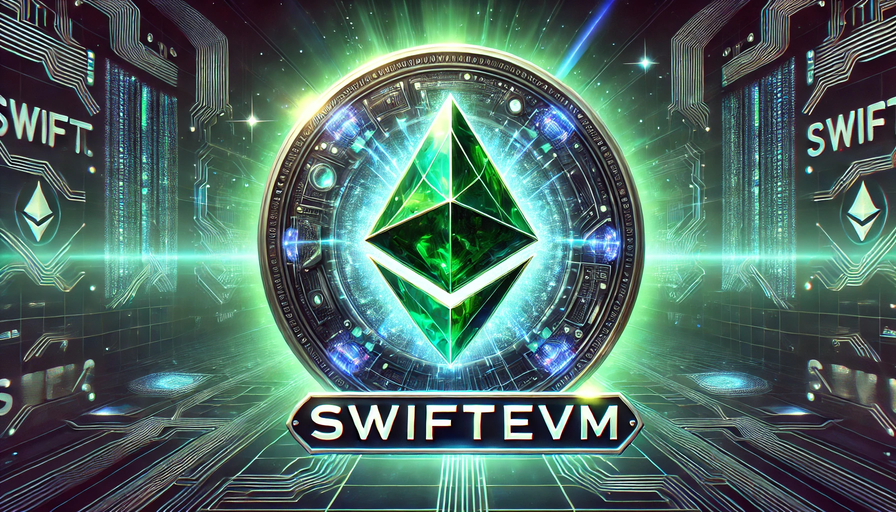

  

  <h1>mrLSD<code>/SwiftEVM</code></h1>
  
<strong>A blazing fast 🚀, pure Swift implementation of the Ethereum Virtual Machine (EVM)</strong>

-----

**SwiftEVM** is a high-performance, open-source implementation of the Ethereum Virtual Machine, 
written entirely in **Swift**. It’s designed to empower both developers and businesses by enabling 
seamless integration of Ethereum smart contract execution into a wide variety of applications.

Our focus is on:
- ⚡ **Speed & Performance**: Critical paths are highly optimized for blazing-fast execution.
- 🔒 **Security & Reliability**: 100% test coverage ensures predictable and robust behavior.
- 🔧 **Extensibility & Maintainability**: A modular architecture that facilitates ongoing improvements and customizations.

Modern development tools such as SwiftLint and swiftformat are part of our workflow, ensuring a clean, 
consistent codebase that is both developers-friendly.

---

## Current Status

- ✅ **EVM Machine**: Fully implemented
- ✅ **EVM Core**: ~90% complete
- ⏳ **EVM Runtime**: Under active development
- 🔜 **Ethereum Hard Forks**:
  - Berlin
  - London
  - Shanghai
  - Cancun
  - Prague

## Integration & Future Plans

- **Blockchain Ecosystem**: Planned integration with [NEAR Protocol](https://near.org/) to broaden 
blockchain interoperability.
- **Key Environments**:
  - **Embedded Systems**: Bring blockchain capabilities to resource-constrained devices.
  - **WebAssembly (WASM)**: Run the EVM directly in web browsers and server environments.
  - **Mobile & Desktop**: Seamlessly integrate decentralized functionalities into **iOS**, **macOS**, and other `Swift`-based platforms.

## Benefits

### For Developers
- **Pure Swift Implementation**: Leverage Swift’s performance and safety to integrate EVM directly into your projects.
- **Cross-Platform Compatibility**: Enjoy hassle-free deployment across multiple platforms.
- **Open Source Community**: Join a vibrant community—contribute, collaborate, and help shape the project’s future.
- **Customization & Extensibility**: Easily adapt and extend the EVM functionality to meet specific project needs.

### For Businesses
- **High-Performance Execution**: Incorporate a robust, optimized EVM that ensures secure and efficient smart contract processing.
- **Future-Proof Technology**: Stay ahead with support for upcoming Ethereum hard forks and integration with leading blockchain protocols.
- **Cost-Effective Innovation**: Utilize an open-source solution to reduce development overhead and accelerate time-to-market for blockchain-enabled applications.

## Get Involved

Whether you're a developer aiming to innovate with decentralized applications or a business looking to integrate blockchain 
technology into your services, **SwiftEVM** offers a cutting-edge solution that meets your needs.

Join us in revolutionizing smart contract execution and expanding the boundaries of blockchain 
technology. Contributions, feedback, and collaborations are highly welcome!

---

*Built with ❤️ by the @mrLSD (Evgeny Ukhanov) and the SwiftEVM community.*

### LICENSE: [MIT](LICENSE)
